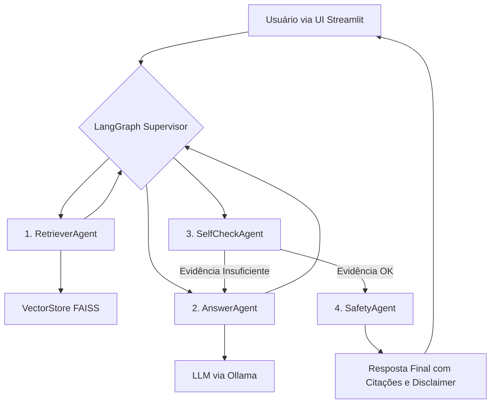

# Dr. Llama 🦙⚖️

Seu assistente de IA para informações sobre a legislação brasileira.

**Dr. Llama** é uma Prova de Conceito (PoC) de um assistente jurídico informativo, construído com uma arquitetura de **RAG (Retrieval-Augmented Generation)** e **Agentes de IA**. O sistema foi desenvolvido como projeto final para a disciplina de LLMs e tem como objetivo democratizar o acesso a informações sobre as leis brasileiras de forma clara e referenciada.

⚠️ **Disclaimer:** Dr. Llama é uma ferramenta experimental para fins informativos. Não é um substituto para aconselhamento jurídico profissional.

## 📜 Índice

- [🎯Problema e Objetivo](#-problema-e-objetivo)
- [✨Funcionalidades](#-funcionalidades)
- [🏗️Arquitetura](#-arquitetura)
- [🚀Como Executar Localmente](#-como-executar-localmente)
  - [Pré-requisitos](#-pré-requisitos)
  - [Instalação](#-instalação)
  - [Executando com Docker](#-executando-com-docker)
- [📂Estrutura do Repositório](#-estrutura-do-repositório)
- [📊Avaliação](#-avaliação)
- [⚖️Limitações Éticas e de Segurança](#-limitações-éticas-e-de-segurança)
- [🗺️Roadmap (Próximos Passos)](#-roadmap-próximos-passos)
- [📄Licença](#-licença)

## 🎯 Problema e Objetivo

O acesso à informação jurídica no Brasil é um desafio para o cidadão comum. A linguagem técnica e a estrutura complexa das leis dificultam a compreensão de direitos e deveres básicos.

O objetivo do **Dr. Llama** é mitigar esse problema, oferecendo uma interface conversacional que responde a perguntas sobre a legislação brasileira com base em fontes oficiais. O sistema utiliza técnicas de RAG para evitar alucinações e garantir que todas as respostas sejam fundamentadas e citem os artigos de lei correspondentes.

## ✨ Funcionalidades

- 💬 **Interface Conversacional:** Dialogue com o sistema em linguagem natural.
- 📚 **Respostas Baseadas em Evidências:** As respostas são geradas a partir de um corpus de documentos legais oficiais (Constituição Federal, Código de Defesa do Consumidor, etc.).
- 🔗 **Citações de Fontes:** Cada resposta inclui referências explícitas aos artigos de lei utilizados, permitindo a verificação da informação.
- 🤖 **Orquestração com Agentes (LangGraph):** Um grafo de agentes gerencia o fluxo da conversa, desde a recuperação da informação até a checagem de segurança e formatação da resposta.
- ✅ **Checagem Anti-Alucinação:** Um agente _SelfCheck_ valida se as informações na resposta estão de fato presentes nos documentos recuperados.
- ⚙️ **100% Open-Source e Local:** Utiliza modelos de LLM open-weights (via Ollama) e bancos de vetores locais (FAISS), garantindo privacidade e total controle sobre o sistema.

## 🏗️ Arquitetura

O Dr. Llama é orquestrado pelo **LangGraph**, que coordena uma equipe de agentes especializados. O fluxo de uma pergunta é o seguinte:



- **UI (Streamlit):** Interface web onde o usuário interage com o sistema.
- **LangGraph Supervisor:** O "maestro" que roteia a tarefa entre os diferentes agentes com base no estado atual da conversa.
- **RetrieverAgent:** Responsável por buscar os trechos de lei mais relevantes para a pergunta do usuário no banco de vetores FAISS.
- **AnswerAgent:** Gera uma resposta em linguagem natural, utilizando o contexto fornecido pelo RetrieverAgent e citando as fontes.
- **SelfCheckAgent:** Compara a resposta gerada com os documentos originais para garantir a fidelidade e evitar a invenção de informações.
- **SafetyAgent:** Adiciona o disclaimer legal a todas as respostas, reforçando o caráter informativo da ferramenta.

**Stack Tecnológica:** Python, LangChain, LangGraph, Ollama (Llama 3.1 8B), FAISS, HuggingFace Embeddings (gte-small), Streamlit, Docker.

## 🚀 Como Executar Localmente

### Pré-requisitos

- Git
- Python 3.10+
- Docker
- Ollama

### Instalação

1. **Clone o repositório:**

```bash
git clone https://github.com/SEU-USUARIO/dr-llama.git
cd dr-llama
```

2. **Configure o Ollama e baixe o LLM:**

- Siga as instruções para instalar o Ollama no seu sistema.
- Baixe o modelo Llama 3.1:

```Bash
ollama pull llama3.1:8b
```

3. **Crie um ambiente virtual e instale as dependências:**

```Bash
python -m venv .venv
source .venv/bin/activate
pip install -r requirements.txt
```

4. **Prepare os dados e o banco de vetores:**

- Adicione os arquivos de lei (ex: constituicao.pdf, cdc.pdf) na pasta /data/raw.
- Execute o script de ingestão para criar o índice FAISS:

```Bash
python ingest/ingest_data.py
```

5. **Inicie a aplicação:**

```Bash
streamlit run app/app.py
```

Abra seu navegador em `http://localhost:8501`.

**Executando com Docker**
Após clonar o repositório e rodar o script de ingestão (passos 1 e 4), você pode construir e executar o container Docker:

```Bash
# Construa a imagem
docker build -t dr-llama .
```

```bash
# Execute o container
docker run -p 8501:8501 dr-llama
```

### 📂 Estrutura do Repositório

```bash
/dr-llama
|
├── .github/workflows/      # Pipelines de CI/CD
├── app/                    # Código da interface Streamlit
├── data/                   # Dados brutos (PDFs) e processados
├── ingest/                 # Scripts para processamento e indexação dos dados
├── src/                    # Lógica principal: agentes, grafo, etc.
├── eval/                   # Scripts e relatórios de avaliação (RAGAS)
├── tests/                  # Testes unitários e de integração
|
├── .gitignore
├── Dockerfile              # Containerização da aplicação
├── LICENSE
├── README.md
└── requirements.txt        # Dependências Python
```

### 📊 Avaliação

A qualidade do sistema é medida utilizando o framework **RAGAS**. Nosso processo de avaliação inclui:

- Um conjunto de **20-30 perguntas** de teste com respostas de referência, localizadas em `eval/test_questions.json`.
- Métricas principais: `Faithfulness`, `Answer Relevancy`, `Context Precision` e `Context Recall`.
- Os resultados detalhados e a análise crítica da performance estão disponíveis no relatório `eval/report.md`.

### ⚖️ Limitações Éticas e de Segurança

- **NÃO é Aconselhamento Jurídico:** Dr. Llama é uma ferramenta de informação, não um consultor legal. As respostas não criam uma relação advogado-cliente.
- **Informação Potencialmente Desatualizada**: O corpus de conhecimento é estático e baseado nos documentos fornecidos na data da ingestão. Leis podem ser alteradas.
- **Sem Garantia de Precisão**: Embora utilize RAG para mitigar alucinações, erros de interpretação ou recuperação podem ocorrer. Sempre verifique as fontes citadas.
- **Complexidade do Caso**: O sistema não considera as nuances e particularidades de um caso real, que são essenciais para uma orientação jurídica adequada.

### 🗺️ Roadmap (Próximos Passos)

- [ ] **Expandir o Corpus:** Incluir mais documentos legais (CLT, Código Civil, etc.).
- [ ] **Melhorar o Retrieval:** Implementar técnicas de re-ranking (Cross-Encoders) para melhorar a relevância dos documentos.
- [ ] **Avaliação Contínua:** Criar um workflow de CI/CD que rode a suíte de avaliação a cada mudança no código.
- [ ] **Deploy:** Publicar a aplicação em uma plataforma como Hugging Face Spaces ou Streamlit Community Cloud.

### 📄 Licença

Este projeto está sob a licença APACHE 2.0. Veja o arquivo [LICENSE](LICENSE) para mais detalhes.
